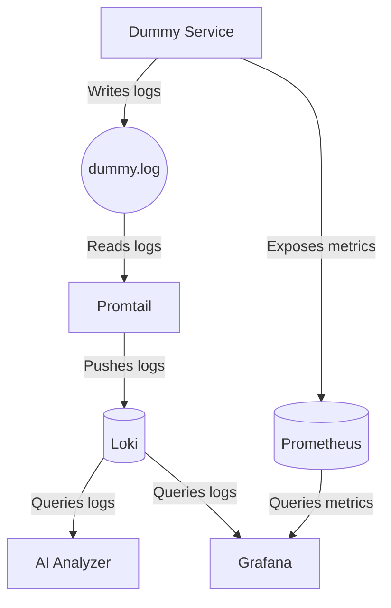

<h1 align="center">🔍 AIOps — AI-Powered Observability & Log Analysis</h1>

<p align="center">
  <strong>Gelişmiş bir log izleme ve analiz sistemi. Dummy servislerin ürettiği metrik ve logları Prometheus & Loki ile toplayıp, LangChain ve Llama 3 (Groq) destekli yapay zeka motoru ile otonom olarak analiz eden ve kök neden (RCA) üreten self-contained bir mimari.</strong>
</p>

<p align="center">
  
  
  
  
  
  
</p>

---

## 📸 Ekran Görüntüleri

### Grafana Canlı İzleme Paneli (Main Dashboard)
*(Dashboard ekran görüntüsünü buraya ekleyin)*

### Yapay Zeka Analizi (Swagger UI)
*(Swagger AI analiz sonucu ekran görüntüsünü buraya ekleyin)*

> **AIOps felsefesi:** Tek bir komutla (`docker compose up`) ayağa kalkan, dış bağımlılığı minimize edilmiş, otomatik log toplayan ve LLM ile yorumlayan tam yığın (full-stack) gözlemlenebilirlik platformu.

---

## Özellikler

| | |
|---|---|
| 🤖 **AI Analizi** | LangChain ve Llama 3 (Groq API) kullanarak sistem hatalarını (Out of Memory, High Latency vb.) okur, analiz eder ve Türkçe RCA (Kök Neden Analizi) üretir. |
| 📊 **Canlı Metrikler** | Prometheus ile CPU, RAM ve İstek (Request) istatistiklerini anlık toplar. |
| 🪵 **Merkezi Loglama** | Promtail & Loki entegrasyonu sayesinde tüm konteyner logları tek bir merkezde toplanır ve filtrelenebilir hale gelir. |
| 📈 **Grafana Dashboard** | Otomatik yüklenen (provisioned) dashboard sayesinde sistemi açar açmaz görselleştirilmiş canlı veriler sunar. |
| 🚀 **Dummy Servis** | Geliştirme ve test süreçleri için rastgele hatalar ve loglar üreten, sisteme trafik sağlayan gömülü bir FastAPI servisi. |
| 🐳 **Docker Compose** | Sadece tek komutla tüm altyapı (Prometheus, Loki, Grafana, Promtail, AI ve Dummy) ayağa kalkar. |

---

## Nasıl Çalışır

1. **Dummy Service Çalışır** — Sistemde rastgele loglar (ERROR, WARNING, INFO) ve metrikler üretir (CPU/Memory simülasyonu). Bu logları ortak bir dosyaya (`dummy.log`) yazar.
2. **Promtail Logları Toplar** — Üretilen logları okur ve merkezi log sunucusu olan **Loki**'ye gönderir.
3. **Prometheus Metrikleri Çeker** — Sistemin sağlık durumunu saniyede bir pull (scrape) metoduyla toplar.
4. **Grafana Görselleştirir** — Loki ve Prometheus'tan aldığı verileri tek bir modern ekranda sunar.
5. **AI Analyzer Yorumlar** — Kullanıcı `/analyze/now` endpoint'ini tetiklediğinde, Loki'deki son 10 dakikalık ERROR loglarını çeker, Llama 3 modeline besler ve sorunun kaynağını/çözümünü söyler.

---

## 🚀 Hızlı Başlangıç

### Gereksinimler
- Docker ve Docker Compose
- Groq API Anahtarı (`GROQ_API_KEY`)

### Kurulum

1. Depoyu klonlayın:
```bash
git clone https://github.com/meryemgcl/AIOps-Observability-Stack.git
cd AIOps-Observability-Stack
```

2. Ortam değişkenlerini ayarlayın (Ana dizinde `.env` dosyası oluşturun):
```env
GROQ_API_KEY=sizin_groq_api_anahtariniz
```

3. Sistemi başlatın:
```bash
docker compose up --build
```

### Bağlantılar
- **Grafana Dashboard:** [http://localhost:3000](http://localhost:3000) (Kullanıcı: `admin`, Şifre: `admin`)
- **AI Analyzer (Swagger):** [http://localhost:8001/docs](http://localhost:8001/docs)
- **Dummy Service (Swagger):** [http://localhost:8000/docs](http://localhost:8000/docs)
- **Prometheus:** [http://localhost:9090](http://localhost:9090)

---

## Mimari


